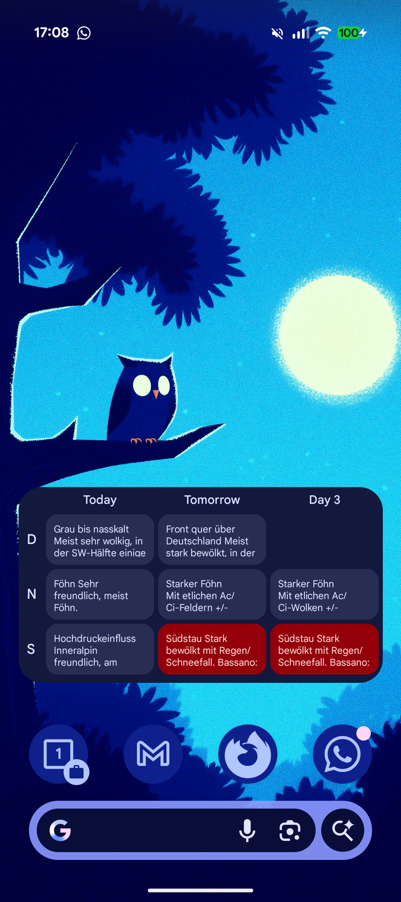

# DHV Weather Widget 🪂

A modern, Material 3-inspired Android widget and companion app for paragliding pilots. It fetches specific forecast data from [dhv.de](https://www.dhv.de/wetter/dhv-wetter/) for Germany, Northern Alps, and Southern Alps, presenting it in a clean, glanceable format.

## Features ✨

*   **Compact Widget:** A 4x2 resizeable widget that fits perfectly on your home screen.
*   **Material You Integration:** fully dynamic colors that adapt to your wallpaper and system theme (Light/Dark mode supported).
*   **Semantic Styling:** Color-coded status cards (Green/Red/Neutral) based on the forecast quality.
*   **Auto-Refresh:**
    *   **On Open:** Updates immediately when you open the app.
    *   **Background:** Refreshes automatically every 3 hours.
*   **Fluid Layout:**
    *   **Widget:** Dynamic header (Today | Tomorrow | Day Name) and fixed rows.
    *   **App:** Full-screen scrollable view with expandable cards for detailed reading.
*   **Google Sans Typography:** Optimized to look native on Pixel devices.

## Installation 📲

1.  Go to the [Releases](../../releases) page.
2.  Download the latest `app-debug.apk`.
3.  Install it on your Android device (you may need to enable "Install from unknown sources").
4.  Long-press your home screen, select **Widgets**, find **DHV Weather**, and drag it to your screen.
